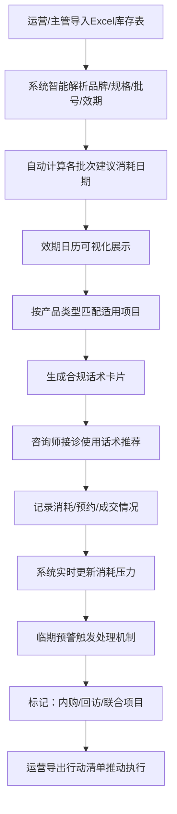
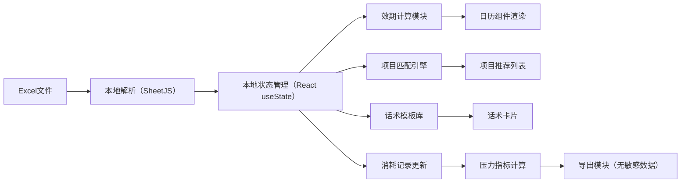

## 1. 产品概述

玻尿酸效期营销协同纯前端看板，专为医美机构的咨询师、运营策划和现场主管设计，支持本地导入库存Excel表，实现效期管理、项目匹配、话术生成、消耗跟踪全流程协同，在不涉及复杂账号系统的前提下，帮助团队合理消耗库存、避免临期浪费、合规营销。

### 核心价值
- 解决玻尿酸库存效期管理混乱问题，可视化提醒临期批次
- 帮助咨询师快速匹配产品与项目，生成合规话术
- 支持隐藏敏感进价信息，便于前台和运营协同
- 自动计算消耗压力，导出可执行的行动清单

---

## 2. 核心功能

### 2.1 用户角色

| 角色 | 使用场景 | 核心需求 |
|------|----------|----------|
| 咨询师 | 日常接诊、推荐项目 | 快速查找合适产品、获取合规话术、记录顾客情况 |
| 运营策划 | 制定活动、推动消耗 | 查看效期压力、匹配营销活动、导出行动清单 |
| 现场主管 | 管理库存、审批内购 | 监控整体库存、设置消耗目标、处理临期批次 |
| 前台 | 登记预约、查看数量 | 仅查看数量和项目，隐藏进价等敏感信息 |

### 2.2 功能模块（单页应用，5大区域）

1. **数据导入区**：拖拽/点击上传Excel，智能识别品牌、规格、批号、数量、到期日、进价
2. **效期日历区**：日历视图展示各批次最后建议消耗日期，颜色区分紧急程度
3. **项目匹配区**：按产品类型（大分子/中分子/小分子）匹配鼻唇沟、泪沟、下巴、轮廓固定等项目
4. **话术卡片区**：为咨询师生成"可主推但不能夸大功效"的合规提醒话术
5. **消耗跟踪区**：记录每支玻尿酸的顾客预约、成交/未成交原因，设置单日消耗目标

### 2.3 页面详情

| 区域名称 | 模块名称 | 功能描述 |
|---------|----------|----------|
| 数据导入区 | Excel上传 | 支持拖拽上传.xlsx/.xls文件，解析列名智能匹配字段 |
| 数据导入区 | 数据预览 | 展示解析后的库存列表，支持手动修正字段映射 |
| 数据导入区 | 进价隐藏开关 | 一键隐藏/显示进价列，适合不同角色使用 |
| 效期日历区 | 月份导航 | 支持月份切换，高亮显示有临期产品的日期 |
| 效期日历区 | 紧急度标识 | 红色（<30天）、橙色（30-90天）、黄色（90-180天）、绿色（>180天） |
| 效期日历区 | 消耗压力计算 | 自动计算剩余天数、日均需消耗数量、完成进度 |
| 项目匹配区 | 产品分类 | 按分子大小自动分类：大分子（塑形）、中分子（填充）、小分子（补水） |
| 项目匹配区 | 部位匹配 | 智能推荐适用部位：鼻子、下巴、鼻唇沟、泪沟、太阳穴、轮廓固定等 |
| 项目匹配区 | 联合项目推荐 | 临期产品可搭配：水光、热玛吉、 Fotona等联合项目 |
| 话术卡片区 | 合规话术生成 | 根据产品特点生成合规话术，禁止"永久""无痕"等夸大词汇 |
| 话术卡片区 | 主推提醒 | 标记当前需要主推的临期产品话术 |
| 话术卡片区 | 禁忌提醒 | 包含禁忌症、注意事项等合规提醒 |
| 消耗跟踪区 | 消耗记录 | 记录每支产品：顾客姓名、预约日期、成交状态、未成交原因 |
| 消耗跟踪区 | 单日目标设置 | 设置建议单日消耗数量，显示进度条 |
| 消耗跟踪区 | 临期处理 | 可标记为：员工内购、老客回访、联合项目促销 |
| 消耗跟踪区 | 导出行动清单 | 导出不含敏感信息的PDF/Excel行动清单 |

---

## 3. 核心流程

### 3.1 主要用户流程

### 3.2 数据流转逻辑

---

## 4. 用户界面设计

### 4.1 设计风格

**整体风格**：医疗专业感 + 轻量商务风，简洁高效不花哨

- **主色调**：医疗蓝 `#165DFF`（专业、信任）
- **辅助色**：
  - 紧急红 `#F53F3F`（临期<30天）
  - 提醒橙 `#FF7D00`（临期30-90天）
  - 关注黄 `#FFAA00`（临期90-180天）
  - 安全绿 `#00B42A`（效期充足）
- **中性色**：浅灰背景 `#F7F8FA`，深灰文字 `#1D2129`，中灰 `#4E5969`
- **按钮样式**：圆角4px，轻阴影，hover状态有微妙颜色加深
- **字体**：
  - 标题：`PingFang SC Medium` / `Microsoft YaHei`，字号16-20px
  - 正文：`PingFang SC Regular`，字号14px
  - 数字：等宽字体提升可读性
- **布局风格**：卡片式布局，5大区域分区明确，顶部全局状态栏
- **图标风格**：线性图标（Ant Design Icons），简洁专业
- **特殊效果**：卡片hover轻微上浮，数据变化时数字滚动动画

### 4.2 页面设计概览

| 区域 | 模块 | UI元素 |
|------|------|--------|
| 顶部状态栏 | 全局概览 | 总库存数、临期预警数、今日消耗进度、进价隐藏开关、导出按钮 |
| 数据导入区 | 上传区域 | 虚线框拖拽区，支持点击选择，解析进度条，数据预览表格 |
| 效期日历区 | 日历视图 | 月历格子，日期内显示批次数量和紧急度色块，悬浮详情卡片 |
| 效期日历区 | 压力指标 | 剩余总数量、剩余天数、日均需消耗、完成率环形进度条 |
| 项目匹配区 | 产品列表 | 按分子大小分类标签页，产品卡片显示适用部位图标 |
| 项目匹配区 | 匹配详情 | 点击产品展开适用项目列表，包含建议用量、搭配方案 |
| 话术卡片区 | 话术列表 | 卡片式布局，主推话术有特殊边框标识，禁忌提示用红色小字 |
| 消耗跟踪区 | 记录表格 | 可编辑表格，支持快速标记成交状态，下拉选择未成交原因 |
| 消耗跟踪区 | 目标设置 | 数字输入框设置日目标，进度条实时更新 |
| 消耗跟踪区 | 临期处理 | 批量选择后可标记处理方式，备注输入框 |

### 4.3 响应式设计

- **桌面优先**：1200px以上完整展示5区域，采用2-3列网格布局
- **平板适配**（768-1200px）：改为上下布局，日历占满宽度，其他区域两列
- **移动适配**（<768px）：垂直堆叠，使用标签页切换5大区域，优化触摸交互
- **触控优化**：按钮最小高度44px，表格支持横向滚动

---

## 5. 合规与安全

### 5.1 数据安全
- 纯前端本地运行，所有数据仅存储在浏览器LocalStorage
- 不上传任何数据到服务器，保护客户信息和进价敏感数据
- 支持一键清空本地数据

### 5.2 营销合规
- 话术库内置合规审查，禁止"永久""无痕""100%有效"等夸大词汇
- 所有话术包含"效果因人而异""需正规医疗机构操作"等风险提示
- 明确标注"本话术仅供参考，实际沟通请遵循医嘱"
