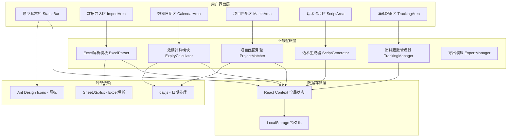
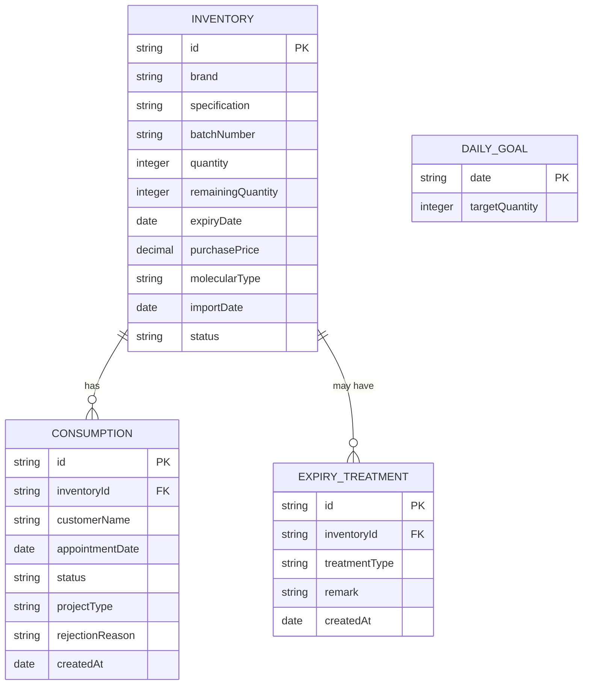

## 1. 架构设计



---

## 2. 技术描述

### 2.1 技术栈选型

| 类别 | 技术 | 版本 | 选型理由 |
|------|------|------|----------|
| 前端框架 | React | 18.x | 组件化开发，状态管理灵活，生态成熟 |
| 构建工具 | Vite | 5.x | 开发体验好，热更新快，打包效率高 |
| 样式方案 | TailwindCSS | 3.x | 原子化CSS，快速构建UI，响应式友好 |
| 语言 | TypeScript | 5.x | 类型安全，提升代码可维护性 |
| Excel解析 | xlsx (SheetJS) | 0.18.x | 纯前端解析Excel，无需后端 |
| 日期处理 | dayjs | 1.11.x | 轻量级，API友好，支持中文本地化 |
| 图标 | @ant-design/icons | 5.x | 线性图标风格，专业医疗感 |
| 导出 | html2canvas + jspdf | 2.x + 2.5.x | 前端导出PDF行动清单 |

### 2.2 项目初始化

使用 Vite 官方模板初始化 React + TypeScript 项目：
```bash
npm create vite@latest . -- --template react-ts
npm install
```

### 2.3 目录结构

```
src/
├── components/           # 组件目录
│   ├── layout/          # 布局组件
│   │   ├── StatusBar.tsx       # 顶部状态栏
│   │   └── SectionCard.tsx     # 区域卡片容器
│   ├── import/          # 数据导入区
│   │   ├── DropZone.tsx        # 文件拖拽上传
│   │   ├── DataPreview.tsx     # 数据预览表格
│   │   └── FieldMapper.tsx     # 字段映射配置
│   ├── calendar/        # 效期日历区
│   │   ├── ExpiryCalendar.tsx  # 日历主组件
│   │   ├── CalendarDay.tsx     # 日历格子
│   │   └── PressurePanel.tsx   # 消耗压力面板
│   ├── match/           # 项目匹配区
│   │   ├── ProductTabs.tsx     # 产品分类标签
│   │   ├── ProductCard.tsx     # 产品卡片
│   │   └── ProjectList.tsx     # 匹配项目列表
│   ├── script/          # 话术卡片区
│   │   ├── ScriptCard.tsx      # 话术卡片
│   │   └── ComplianceBadge.tsx # 合规标识
│   └── tracking/        # 消耗跟踪区
│       ├── ConsumptionTable.tsx # 消耗记录表
│       ├── DailyGoal.tsx        # 单日目标设置
│       ├── ExpiryHandler.tsx    # 临期处理
│       └── ExportButton.tsx     # 导出按钮
├── hooks/               # 自定义Hooks
│   ├── useInventory.ts         # 库存数据管理
│   ├── useLocalStorage.ts      # 本地存储
│   └── useExpiryCalc.ts        # 效期计算
├── utils/               # 工具函数
│   ├── excelParser.ts         # Excel解析
│   ├── expiryCalculator.ts    # 效期计算逻辑
│   ├── projectMatcher.ts      # 项目匹配引擎
│   ├── scriptGenerator.ts     # 话术生成
│   └── exportManager.ts       # 导出功能
├── types/               # TypeScript类型定义
│   └── index.ts
├── data/                # 静态数据
│   ├── products.ts            # 产品库（品牌、规格、分子类型）
│   ├── projects.ts            # 项目库（部位、适用产品）
│   └── scripts.ts             # 话术模板库
├── context/             # React Context
│   └── AppContext.tsx         # 全局状态管理
├── App.tsx              # 主应用组件
├── main.tsx             # 入口文件
└── index.css            # 全局样式（Tailwind）
```

---

## 3. 数据模型

### 3.1 核心数据类型



### 3.2 TypeScript 类型定义

```typescript
// 库存条目
interface InventoryItem {
  id: string;
  brand: string;           // 品牌
  specification: string;   // 规格（如：1ml/支）
  batchNumber: string;     // 批号
  quantity: number;        // 入库数量
  remainingQuantity: number; // 剩余数量
  expiryDate: string;      // 到期日 YYYY-MM-DD
  purchasePrice?: number;  // 进价（可选，可隐藏）
  molecularType: 'macromolecule' | 'medium' | 'micromolecule'; // 分子类型
  importDate: string;      // 导入日期
  status: 'normal' | 'urgent' | 'warning' | 'expired'; // 状态
}

// 消耗记录
interface ConsumptionRecord {
  id: string;
  inventoryId: string;
  customerName: string;
  appointmentDate: string;
  status: 'appointment' | 'completed' | 'cancelled';
  projectType: string;
  rejectionReason?: string;
  createdAt: string;
}

// 临期处理
interface ExpiryTreatment {
  id: string;
  inventoryId: string;
  treatmentType: 'staff_purchase' | 'customer_return' | 'combo_project';
  remark: string;
  createdAt: string;
}

// 效期紧急度
type UrgencyLevel = 'safe' | 'attention' | 'warning' | 'danger';

// 项目匹配
interface MatchedProject {
  id: string;
  name: string;
  area: string;
  suggestedDosage: string;
  suitableProducts: string[];
}

// 话术卡片
interface ScriptCard {
  id: string;
  productId: string;
  title: string;
  content: string;
  isKeyPromotion: boolean;
  warnings: string[];
}
```

---

## 4. 核心模块设计

### 4.1 Excel解析模块 (excelParser.ts)

**功能**：
- 支持 .xlsx / .xls 格式文件
- 智能识别列名（品牌、规格、批号、数量、到期日、进价）
- 支持模糊匹配列名（如"有效期"、"到期时间"都识别为到期日）
- 日期格式自动转换

**核心算法**：
```typescript
// 列名模糊匹配规则
const columnMatchRules = {
  brand: ['品牌', '品名', '产品名称', 'product'],
  specification: ['规格', '型号', 'spec'],
  batchNumber: ['批号', '批次', 'batch'],
  quantity: ['数量', '库存', '支数', 'qty'],
  expiryDate: ['到期日', '有效期', '效期', 'expiry'],
  purchasePrice: ['进价', '成本', '单价', 'price']
};
```

### 4.2 效期计算模块 (expiryCalculator.ts)

**功能**：
- 计算距离到期日天数
- 按紧急度分级（安全/关注/警告/危险）
- 计算建议最后消耗日期（到期日前30天）
- 计算日均需消耗数量 = 剩余数量 / 剩余天数
- 计算完成进度 = 已消耗数量 / (日均消耗 * 已过天数)

**紧急度分级规则**：
```typescript
function getUrgencyLevel(daysUntilExpiry: number): UrgencyLevel {
  if (daysUntilExpiry <= 0) return 'expired';
  if (daysUntilExpiry <= 30) return 'danger';     // 红色
  if (daysUntilExpiry <= 90) return 'warning';    // 橙色
  if (daysUntilExpiry <= 180) return 'attention'; // 黄色
  return 'safe';                                   // 绿色
}
```

### 4.3 项目匹配引擎 (projectMatcher.ts)

**功能**：
- 根据分子类型匹配适用部位
- 大分子 → 塑形：鼻子、下巴、轮廓固定
- 中分子 → 填充：鼻唇沟、太阳穴、苹果肌
- 小分子 → 补水/细纹：泪沟、嘴唇、颈部细纹
- 临期产品推荐联合项目

**匹配规则**：
```typescript
const molecularMapping = {
  macromolecule: ['鼻子', '下巴', '下颌线', '眉骨', '轮廓固定'],
  medium: ['鼻唇沟', '太阳穴', '苹果肌', '面颊', '法令纹'],
  micromolecule: ['泪沟', '嘴唇', '颈部', '手部', '浅表细纹']
};
```

### 4.4 话术生成器 (scriptGenerator.ts)

**功能**：
- 根据产品特点生成合规话术
- 内置违禁词检测过滤
- 主推临期产品话术
- 自动添加合规提示

**合规规则**：
- 禁止词汇：永久、无痕、100%、彻底、永不、神效
- 必须包含：效果因人而异、需正规医疗机构操作
- 话术风格：专业、温和、不夸大

---

## 5. 状态管理

### 5.1 React Context 全局状态

```typescript
interface AppState {
  inventory: InventoryItem[];
  consumptionRecords: ConsumptionRecord[];
  expiryTreatments: ExpiryTreatment[];
  dailyGoals: Record<string, number>;
  showPurchasePrice: boolean;
  currentMonth: string;
}

interface AppContextType {
  state: AppState;
  dispatch: React.Dispatch<AppAction>;
  // 便捷方法
  addInventory: (items: InventoryItem[]) => void;
  updateInventory: (id: string, updates: Partial<InventoryItem>) => void;
  addConsumption: (record: ConsumptionRecord) => void;
  togglePriceVisibility: () => void;
  clearAllData: () => void;
}
```

### 5.2 LocalStorage 持久化

- 存储键名：`hyaluronic-acid-dashboard-v1`
- 自动保存：每次状态变更后 debounce 500ms 保存
- 自动恢复：应用启动时从 LocalStorage 加载

---

## 6. 导出模块

### 6.1 行动清单导出

**导出内容（不含敏感信息）**：
- 临期产品列表（品牌、规格、数量、剩余天数）
- 建议主推项目
- 话术要点
- 单日消耗目标
- 待跟进顾客列表

**导出格式**：
- Excel：使用 xlsx 库生成
- PDF：使用 html2canvas + jspdf 生成

---

## 7. 性能优化

1. **数据量大时虚拟滚动**：库存表超过100条时使用虚拟滚动
2. **计算缓存**：效期计算结果使用 useMemo 缓存
3. **防抖保存**：LocalStorage 保存使用防抖
4. **代码分割**：各区域组件按需加载
